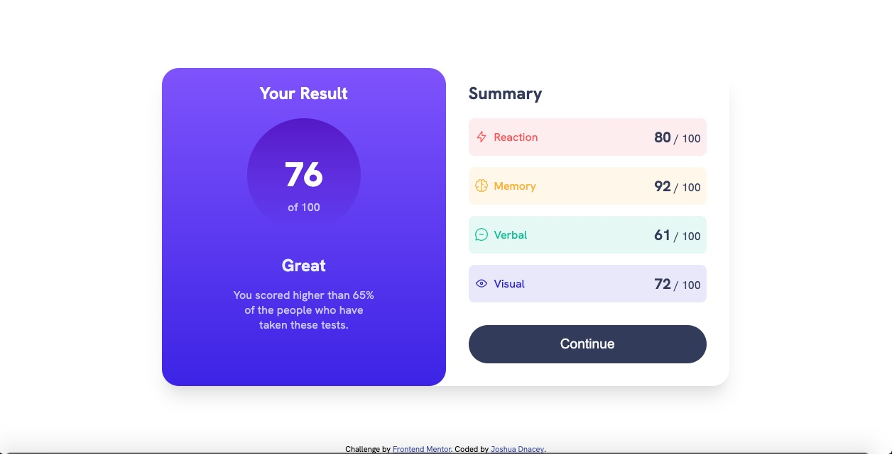

# Frontend Mentor - Results summary component solution

This is a solution to the [Results summary component challenge on Frontend Mentor](https://www.frontendmentor.io/challenges/results-summary-component-CE_K6s0maV). Frontend Mentor challenges help you improve your coding skills by building realistic projects.

## Table of contents

- [Overview](#overview)
  - [The challenge](#the-challenge)
  - [Screenshot](#screenshot)
  - [Links](#links)
- [My process](#my-process)
  - [Built with](#built-with)
  - [What I learned](#what-i-learned)
- [Author](#author)
- [Acknowledgments](#acknowledgments)

## Overview

Completed the challenge as per project specs. This was made responsive with a break-point of 768px and has been hooked up to the JSON data.

### Screenshot

### Links

- Solution URL: [github link](https://github.com/joshD90/Frontend-Mentor)
- Live Site URL: [Add live site URL here](https://your-live-site-url.com)

### Built with

- Semantic HTML5
- CSS custom properties
- Flexbox
- Mobile-first workflow
- Javascript (no framework)

### What I learned

It has been a while since I've done much with vanilla js without a framework and enjoyed learning about import assertions for the JSON file.
In doing the corner borders on the summary segments, I became more familiar with pseudo elements such as ::before and ::after.

## Author

- Website - [Joshua Dancey](https://www.joshuadanceywebdev.ie)
- Frontend Mentor - [@joshD90](https://www.frontendmentor.io/profile/joshD90)

## Acknowledgments

I would like to acknowledge the Tailwind team, from whom I borrowed the shadow classes
